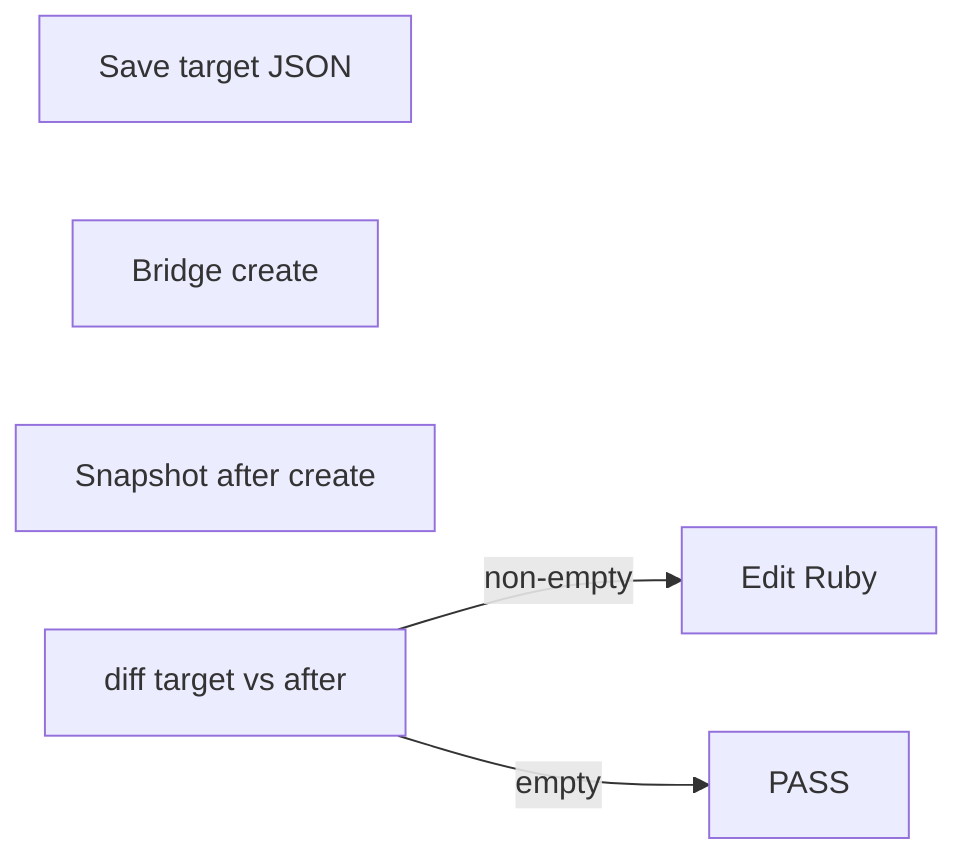

# Extendable bed geometry snapshots (SketchUp bridge)

Two workflows share the same tooling:

1. **Manual → code** — Capture a **target** snapshot from the edited model, patch Ruby (`Config`, `Part` `at:`/`size:`, assemblies), re-run **`create` in SketchUp**, and **repeat until `diff(target, after_create)` is empty**.
2. **Refactor check** — Freeze the committed baseline, run `create`, **`diff_files(reference, GEOMETRY_BASELINE_JSON)`**; empty diff means geometry unchanged (see [Refactor regression check](#refactor-regression-check-geometry-must-stay-identical)).

## Limitations (tell the user if relevant)

- Snapshots are **world-space AABBs** per **leaf group** (no child groups). Same box with different rotation may not diff; internal face-only changes might be invisible.
- Only **top-level `Sketchup::Group`** roots are walked (optionally filtered). Component instances at the root are ignored.
- Mapping **mm bbox delta → exact `at:`/`size:`** needs judgment (parent transforms, shared `Config`).

## Files and constants

- Snapshot API: [`scripts/sketchup_utils/named_group_geometry_snapshot.rb`](scripts/sketchup_utils/named_group_geometry_snapshot.rb) — `Timmerman::SketchupUtils::NamedGroupGeometrySnapshot`.
- After each successful bed build, baseline JSON: `Timmerman::ExtendableBed::Config::GEOMETRY_BASELINE_JSON` → [`scripts/extendable-bed/references/extendable_bed_geometry_baseline.json`](scripts/extendable-bed/references/extendable_bed_geometry_baseline.json).
- **Target** (manual model, stable until the loop passes): e.g. `scripts/extendable-bed/references/extendable_bed_geometry_target.json` — **do not overwrite** once captured for a session until verification passes or the user aborts.
- **Refactor / regression check** (no manual model): bridge command [`sketchup_bridge/commands/validate_extendable_bed_geometry_baseline.rb`](sketchup_bridge/commands/validate_extendable_bed_geometry_baseline.rb) — freezes the committed baseline, runs `clear` + `create`, diffs reference vs freshly written `GEOMETRY_BASELINE_JSON` with `NamedGroupGeometrySnapshot.diff_files`. See subsection below.

## Preconditions

1. Listener running; use the bridge — do not ask the user to paste into the Ruby Console for iteration.
2. User has **not** run bed `clear` / `create` after manual edits (rebuild would erase them). If they already did, they must re-apply manual edits or restore from a saved `.skp`.

## Bridge: capture without rebuild (KISS)

The listener only runs [`sketchup_bridge/command.rb`](sketchup_bridge/command.rb). A default run calls **`clear` + `create`**, which **erases manual edits** — so capture the target **before** any default run while the model still has your changes.

**Capture target (no rebuild):**

1. In `command.rb`, temporarily **replace** the default `load … extendable-bed` + `clear` + `create` block with:
   ```ruby
   load File.expand_path('commands/capture_extendable_bed_target.rb', __dir__)
   ```
2. `ruby sketchup_bridge/run_and_wait.rb`
3. **Restore** `command.rb` (e.g. `git checkout -- sketchup_bridge/command.rb` or undo in the editor).

**Iterate after code changes:** leave the default `command.rb`, then `ruby sketchup_bridge/run_and_wait.rb` (rebuilds).

**Risk:** if something triggers a default bridge run while `command.rb` still rebuilds, you lose manual edits — keep capture as a short, deliberate swap + restore.

## Root filter (extendable bed)

Use the same filter as `BedLayout` / `clear` so unrelated model groups are excluded:

```ruby
root_filter = lambda do |g|
  Timmerman::ExtendableBed::Config::GROUP_NAME_RE.match?(g.name) ||
    Timmerman::ExtendableBed::Config::SINGLE_PAIR_ROOTS.include?(g.name)
end
```

## Step A — Capture target snapshot (once per manual session)

Swap `command.rb` to load [`sketchup_bridge/commands/capture_extendable_bed_target.rb`](sketchup_bridge/commands/capture_extendable_bed_target.rb) (see section above), run `ruby sketchup_bridge/run_and_wait.rb`, restore `command.rb`.

To change what is saved, edit that capture file (still **no** `clear` / `create` there).

## Step B — Initial diff (optional)

The capture script already prints baseline vs target. To compare only, run the same `Snap.diff_files` logic from a temporary `command.rb` or a small Ruby script on the host.

## Step C — Map mismatches to code

For each `[MISMATCH]` / `[ADDED]` / `[MISSING]` line:

- The key is the Outliner path; the **last segment** matches `Part#name` / group names from [`renderer.rb`](scripts/extendable-bed/lib/renderer.rb).
- **Grep** the repo for that string and for parent root names from [`config.rb`](scripts/extendable-bed/lib/config.rb) (`GROUP_EXT_BACK`, etc.).
- Edit generators: [`frame_assembly.rb`](scripts/extendable-bed/lib/frame_assembly.rb), [`bed_pair.rb`](scripts/extendable-bed/lib/bed_pair.rb), [`config.rb`](scripts/extendable-bed/lib/config.rb) — prefer **one** `Config` change when many parts move together.

### Config-first and relational dimensions (critical)

- **Reuse and extend what exists** in [`config.rb`](scripts/extendable-bed/lib/config.rb): primary inputs (`beam_narrow`, `beam_wide`, `plank_thickness`, `top_of_slats_z`, …) and derived `def` helpers (`z_slat_bottom`, `leg_height`, `cap_x0`, …). Add a new `def` there when a value is a design parameter or reused in more than one part, instead of embedding unexplained literals in assemblies.
- **Express geometry as alignment to other dimensions**: positions/sizes should read as relationships (flush with `z_slat_bottom`, span from inner leg to inner leg, `2 * beam_wide`, `leg_height + plank_thickness`, same X as another beam) rather than orphan numbers lifted from a bbox unless that number is intentionally a new primary input.
- When a manual delta is a raw length (e.g. +50 mm), **interpret it**: is it a stock section, a gap, a multiple of `plank_thickness` / `beam_narrow`, or an offset from an existing chain? Prefer wiring through `Config` so the model stays self-consistent when inputs change.
- **AABB overlap validator** ([`validator.rb`](scripts/extendable-bed/lib/validator.rb)): **never** add exceptions, allowlists, or “intentional bearing” skips. If `[EB validate] FAIL` reports overlaps, fix geometry — do not weaken the validator.

### All variants = same components, different placement (critical)

The extendable-bed **preview pairs** (`EB_Ext1_*`, `EB_Half_*`, `EB_Ext_*`, `EB_Ret_*`, `EB_RetGnd_*`, …) are **not** five independent designs. Each pair is the same **`BackFrame` / `FrontFrame`** geometry in **local** space; [`bed_layout.rb`](scripts/extendable-bed/lib/bed_layout.rb) composes them via [`BedPairCatalog`](scripts/extendable-bed/lib/construction_steps.rb) / [`bed_pair.rb`](scripts/extendable-bed/lib/bed_pair.rb), varying **`offset_x`**, **`foot_world_y`**, **`pillow_mode`**, and construction-step **`variant`** / highlights.

When a mismatch appears under **one** root (e.g. `EB_Half_Front / EB | plank | foot | ledge`):

- **Do not** fix it by branching on that root name (`group_name == GROUP_HALF_FRONT`, etc.) unless the user explicitly wants **that** mode to differ from the others.
- **Do** interpret the bbox delta as a change to the **shared** part definition (usually `Config` or `BackFrame` / `FrontFrame` in [`frame_assembly.rb`](scripts/extendable-bed/lib/frame_assembly.rb)) so **every** pair’s copy of that part updates the same way.
- If the user only edited **one** variant in SketchUp, either **repeat the same edit** on every preview root before capture, or implement the shared code change and accept that the target snapshot will show mismatches on the roots they did not touch until they align the model (or recapture after editing all copies).

The same leaf name under multiple roots should produce **matching local** boxes (world AABBs differ only by translation of the pair). Multiple `[MISMATCH]` lines for the same **last path segment** under different `EB_*` roots usually mean **one** shared fix, not per-root hacks.

## Step D — Mandatory iteration until snapshots match

**Do not stop after a single edit.** After every code change:

1. Run `ruby sketchup_bridge/run_and_wait.rb` (default — rebuilds).
2. After rebuild, `GEOMETRY_BASELINE_JSON` is refreshed by `create`; you can diff that file against the target, or snapshot to another path via a temporary `command.rb` load if you need a side-by-side file.
3. `issues = Snap.diff_files(target, after_create_path)` (or `Snap.diff(target_hash, new_hash)`).
4. **If `issues.any?`**: print the list, patch code, go to step 1.
5. **If `issues.empty?`**: print **`PASS: snapshots match`** and stop. The on-disk `GEOMETRY_BASELINE_JSON` from `create` should now align with the target for future runs.

Only skip the loop if the user **explicitly** accepts a documented residual (e.g. unavoidable AABB ambiguity).

## Refactor regression check (geometry must stay identical)

Use this when **Ruby generators** change (refactor, DRY, reorder `BedPair` list) and there is **no** manual SketchUp target — you only need proof that world AABBs match the **last good committed** baseline.

1. **Freeze reference:** `cp scripts/extendable-bed/references/extendable_bed_geometry_baseline.json /tmp/eb_geometry_baseline_ref.json` (or any stable path; the validate script defaults to `/tmp/eb_geometry_baseline_ref.json`).
2. **Swap** [`sketchup_bridge/command.rb`](sketchup_bridge/command.rb) to load only:
   ```ruby
   load File.expand_path('commands/validate_extendable_bed_geometry_baseline.rb', __dir__)
   ```
3. `ruby sketchup_bridge/run_and_wait.rb` — expect **`PASS: geometry snapshot matches reference`** in stdout.
4. **Restore** `command.rb` to the normal `clear` + `create` block.

**Not** the skeleton-dimensions flow in [refactor-with-validation](.cursor/skills/refactor-with-validation/SKILL.md) (`dim_baseline.txt`); that plugin is separate from extendable bed.

## Flow summary


