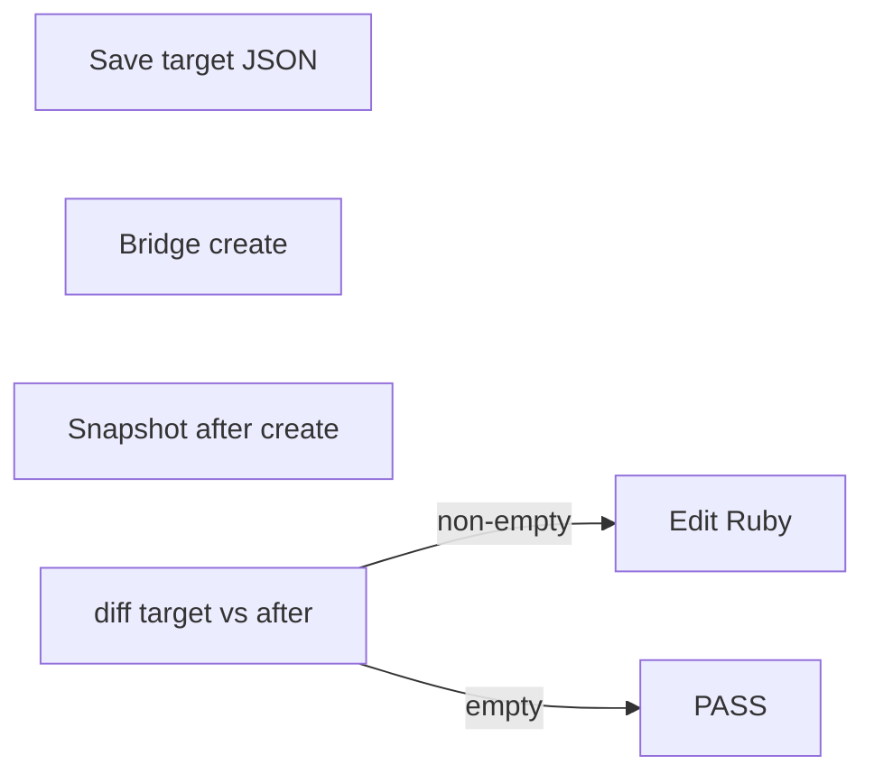

# Manual SketchUp edits → code (geometry snapshot loop)

End-to-end workflow: capture a **target** snapshot from the manually edited model, patch Ruby (`Config`, `Part` `at:`/`size:`, assemblies), re-run **`create` in SketchUp**, and **repeat until `diff(target, after_create)` is empty**.

## Limitations (tell the user if relevant)

- Snapshots are **world-space AABBs** per **leaf group** (no child groups). Same box with different rotation may not diff; internal face-only changes might be invisible.
- Only **top-level `Sketchup::Group`** roots are walked (optionally filtered). Component instances at the root are ignored.
- Mapping **mm bbox delta → exact `at:`/`size:`** needs judgment (parent transforms, shared `Config`).

## Files and constants

- Snapshot API: [`scripts/sketchup_utils/named_group_geometry_snapshot.rb`](scripts/sketchup_utils/named_group_geometry_snapshot.rb) — `Timmerman::SketchupUtils::NamedGroupGeometrySnapshot`.
- After each successful bed build, baseline JSON: `Timmerman::ExtendableBed::Config::GEOMETRY_BASELINE_JSON` → [`scripts/extendable-bed/references/extendable_bed_geometry_baseline.json`](scripts/extendable-bed/references/extendable_bed_geometry_baseline.json).
- **Target** (manual model, stable until the loop passes): e.g. `scripts/extendable-bed/references/extendable_bed_geometry_target.json` — **do not overwrite** once captured for a session until verification passes or the user aborts.

## Preconditions

1. Listener running; use the bridge ([`sketchup_bridge/command.rb`](sketchup_bridge/command.rb) + `ruby sketchup_bridge/run_and_wait.rb`) — do not ask the user to paste into the Ruby Console for iteration.
2. User has **not** run bed `create` after manual edits (rebuild would erase them). If they already did, they must re-apply manual edits or restore from a saved `.skp`.

## Root filter (extendable bed)

Use the same filter as `BedLayout` / `clear` so unrelated model groups are excluded:

```ruby
root_filter = lambda do |g|
  Timmerman::ExtendableBed::Config::GROUP_NAME_RE.match?(g.name) ||
    Timmerman::ExtendableBed::Config::SINGLE_PAIR_ROOTS.include?(g.name)
end
```

## Step A — Capture target snapshot (once per manual session)

In `command.rb` (bridge), after loading extendable-bed + util:

```ruby
eb = File.expand_path('../scripts/extendable-bed/extendable-bed.rb', __dir__)
load eb
util = File.expand_path('../scripts/sketchup_utils/named_group_geometry_snapshot.rb', __dir__)
load util

Snap = Timmerman::SketchupUtils::NamedGroupGeometrySnapshot
cfg  = Timmerman::ExtendableBed::Config
root_filter = ->(g) { cfg::GROUP_NAME_RE.match?(g.name) || cfg::SINGLE_PAIR_ROOTS.include?(g.name) }

target = File.expand_path('../scripts/extendable-bed/references/extendable_bed_geometry_target.json', __dir__)
Snap.save_snapshot(target, Sketchup.active_model, root_filter: root_filter)
"OK"
```

Adjust paths if `command.rb` is resolved differently (use `File.expand_path` from the bridge dir).

## Step B — Initial diff (optional)

Compare last **code** baseline to **target** (what the user changed vs last `create`):

```ruby
issues = Snap.diff_files(cfg::GEOMETRY_BASELINE_JSON, target, label_a: 'baseline', label_b: 'target')
puts issues.empty? ? 'No diff vs last create' : issues.join("\n")
```

## Step C — Map mismatches to code

For each `[MISMATCH]` / `[ADDED]` / `[MISSING]` line:

- The key is the Outliner path; the **last segment** matches `Part#name` / group names from [`renderer.rb`](scripts/extendable-bed/lib/renderer.rb).
- **Grep** the repo for that string and for parent root names from [`config.rb`](scripts/extendable-bed/lib/config.rb) (`GROUP_EXT_BACK`, etc.).
- Edit generators: [`frame_assembly.rb`](scripts/extendable-bed/lib/frame_assembly.rb), [`bed_pair.rb`](scripts/extendable-bed/lib/bed_pair.rb), [`config.rb`](scripts/extendable-bed/lib/config.rb) — prefer **one** `Config` change when many parts move together.

## Step D — Mandatory iteration until snapshots match

**Do not stop after a single edit.** After every code change:

1. Run bridge `command.rb` that loads extendable-bed and calls `Timmerman::ExtendableBed::BedLayout.new.create` (or `Timmerman::ExtendableBed.create` if that is wired).
2. Write a **fresh** after-create snapshot to a temp path, e.g. `extendable_bed_geometry_after_create.json`, with the **same** `root_filter`.
3. `issues = Snap.diff_files(target, after_create_path)` (or `Snap.diff(target_hash, new_hash)`).
4. **If `issues.any?`**: print the list, patch code, go to step 1.
5. **If `issues.empty?`**: print **`PASS: snapshots match`** and stop. The on-disk `GEOMETRY_BASELINE_JSON` from `create` should now align with the target for future runs.

Only skip the loop if the user **explicitly** accepts a documented residual (e.g. unavoidable AABB ambiguity).

## Flow summary


